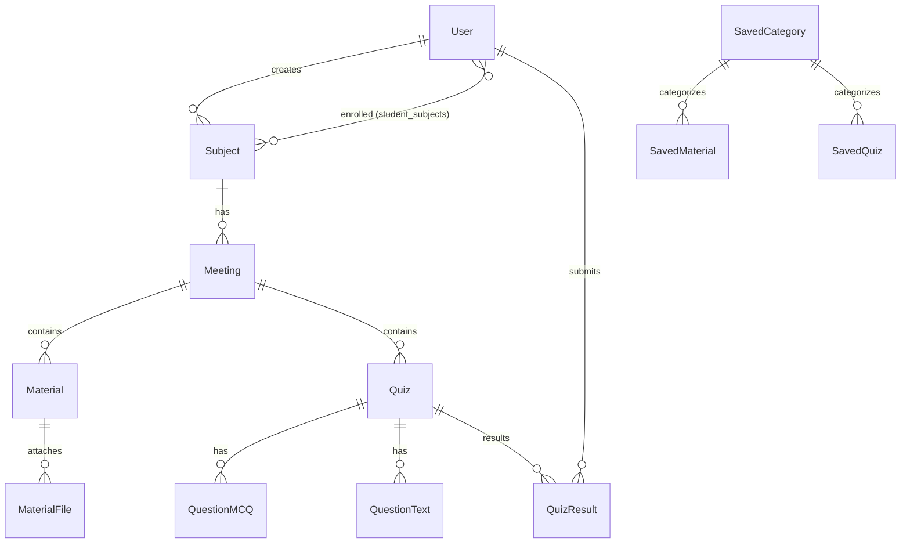

# Tenebris-Class — AI Master Context & Specification Guide (AI_GUIDE)

> **Dokumen Panduan & Konteks Khusus untuk Artificial Intelligence (LLM, AI Agent, AI Coding Assistant)**  
> Versi Dokumen: 2.0  
> Terakhir Diperbarui: 2026-10-05  
> Repositori: `jeruk125/Tenebris-Class`

---

## 📌 1. Tujuan Dokumen Ini
Dokumen ini disusun sebagai **Single Source of Truth (SSOT)** agar sistem AI (seperti Google Gemini, ChatGPT, Claude, Cursor, maupun agent pengembang) memahami secara mendalam arsitektur, basis data, alur aplikasi, dan bahasa markup khusus (**Tenebris-Class Markup Language / TCML**).

Dengan membaca dokumen ini, AI dapat:
1. **Menghasilkan Konten Pembelajaran yang 100% Valid**: Menghasilkan materi (`[MATERIAL]`), latihan (`[EXERCISE]`), proyek (`[PROJECT]`), dan kuis (`[QUIZ]`) yang lolos verifikasi AST parser tanpa syntax error.
2. **Mengembangkan dan Mengelola Kode**: Memodifikasi atau memperluas fitur backend (Flask/SQLAlchemy), frontend (Jinja2/CSS), maupun parser AST tanpa merusak integritas sistem yang sudah ada.
3. **Mencegah Kerusakan Data & Parsing Error**: Mematuhi aturan sintaks, relasi basis data, dan proteksi keamanan (XSS sanitization).

---

## 🏗️ 2. Arsitektur & Gambaran Umum Sistem

Tenebris-Class adalah **Learning Management System (LMS)** berbasis web yang dikembangkan menggunakan **Python Flask** dan **SQLite**.

### 2.1 Tech Stack
| Komponen | Teknologi | Keterangan |
|---|---|---|
| **Backend** | Python 3.10+ / Flask 3.0.0 | Web application routing, session, API |
| **Database** | SQLite + Flask-SQLAlchemy 3.1.1 | Relational database ORM |
| **Authentication** | Flask-Login 0.6.3 + Werkzeug 3.0.1 | Role-based session and password hashing |
| **Parsing Engine** | Custom AST Parser (`parsers.py`) | Tokenizer + AST Builder + HTML Renderer |
| **Frontend** | Jinja2 Templates + Vanilla CSS | CSS Custom Properties, Responsive UI |
| **File Storage** | Local Directory (`static/uploads/`) | Mendukung PNG, JPG, JPEG, GIF, PDF, MP4 (Maks 16MB) |

### 2.2 Struktur Hierarki Pembelajaran
Struktur inti LMS diorganisasikan dalam tiga tingkat:
```text
Subject (Mata Pelajaran)
  └── Meeting (Pertemuan ke-n)
        ├── Material (Materi Teks Pembelajaran + File Lampiran)
        └── Quiz (Kuis Pilihan Ganda atau Esai)
```

### 2.3 Peran Pengguna (User Roles)
Sistem memiliki 3 tingkat akses (`role` pada model `User`):
1. **`siswa` (Student)**:
   - Mendaftar mandiri via `/register` atau didaftarkan admin.
   - Masuk melalui portal `/login`.
   - Melihat mata pelajaran tempat dia terdaftar (`enrolled_subjects`).
   - Membaca materi pertemuan dan mengunduh file lampiran.
   - Mengerjakan kuis (skor pilihan ganda dihitung otomatis, esai menunggu penilaian guru).
   - Melihat riwayat pengerjaan kuis dan detail evaluasi nilai.
2. **`guru` (Teacher)**:
   - Masuk melalui portal khusus `/admin_login`.
   - Membuat dan mengelola Mata Pelajaran (`Subject`) dan Pertemuan (`Meeting`).
   - Membuat/mengedit Materi (`Material`) dan mengunggah lampiran dokumen/video.
   - Membuat/mengedit Kuis (`Quiz`), baik Pilihan Ganda (`pilihan_ganda`) maupun Esai (`teks`).
   - Mendaftarkan atau mengeluarkan siswa dari kelas (`manage_students`).
   - Menilai jawaban esai siswa (`admin_quiz_result_detail`).
   - Menyimpan materi/kuis ke **Bank Materi** & **Bank Kuis** serta mengimpornya ke pertemuan lain.
3. **`admin` (Administrator)**:
   - Memiliki semua hak akses guru.
   - Mengelola semua akun pengguna (`/admin/users`), termasuk mengubah role atau reset akun.
   - Mengakses seluruh bank materi dan bank kuis global.

---

## 📂 3. Peta Direktori & File Inti

```text
Tenebris-Class/
│
├── app.py                  # Entry point aplikasi Flask: routes, controllers, session handling
├── extensions.py           # Inisialisasi db (SQLAlchemy) & login_manager
├── models.py               # Definisi schema database (11 model entitas)
├── parsers.py              # Engine AST Parser untuk TCML dan parser legacy
├── requirements.txt        # Dependensi Python
├── README.md               # Dokumentasi umum untuk manusia
├── docs/
│   ├── AI_CONTENT_GENERATION_PROMPT.md  # Template prompt sederhana
│   └── PARSER_FORMAT.md                 # Spesifikasi awal format TCML
│
├── templates/              # File HTML Jinja2
│   ├── base.html                        # Layout utama + navigasi
│   ├── login.html                       # Login siswa
│   ├── admin_login.html                 # Login guru / admin
│   ├── register.html                    # Registrasi siswa baru
│   ├── student_dashboard.html           # Beranda siswa
│   ├── student_subject.html             # Daftar pertemuan untuk siswa
│   ├── student_material.html            # Tampilan baca materi (render HTML hasil parser)
│   ├── student_quiz.html                # Tampilan pengerjaan kuis
│   ├── quiz_result.html                 # Hasil kuis siswa
│   ├── teacher_dashboard.html           # Beranda guru / admin
│   ├── teacher_subject.html             # Manajemen pertemuan & import bank
│   ├── manage_students.html             # Manajemen enrollment siswa
│   ├── material_form.html               # Form tambah/edit materi & upload file
│   ├── quiz_form.html                   # Form tambah/edit kuis & interactive parser box
│   ├── quiz_results_admin.html          # Daftar nilai kuis seluruh siswa
│   ├── admin_quiz_result_detail.html    # Penilaian kuis esai oleh guru
│   ├── admin_users.html                 # Manajemen pengguna oleh admin
│   └── bank.html                        # Manajemen Bank Materi & Bank Kuis
│
├── static/
│   ├── css/
│   │   └── style.css       # Styling aplikasi dan komponen hasil render TCML
│   └── uploads/            # Direktori penyimpanan file upload materi
│
└── test_parsers.py         # Unit testing untuk engine parser
```

---

## 🗄️ 4. Skema Basis Data & Model Domain (`models.py`)

Aplikasi menggunakan SQLite melalui Flask-SQLAlchemy. Berikut adalah spesifikasi lengkap model data:



### Rincian Model:
1. **`User`**:
   - `id`: Integer, Primary Key.
   - `username`: String(150), Unique, Not Null.
   - `password_hash`: String(256), Not Null (menggunakan `generate_password_hash`).
   - `role`: String(20), Not Null (`'admin'`, `'guru'`, atau `'siswa'`).
2. **`Subject`**:
   - `id`: Integer, Primary Key.
   - `nama`: String(200), Not Null.
   - `dibuat_oleh`: FK -> `user.id`.
3. **`Meeting`**:
   - `id`: Integer, Primary Key.
   - `subjek_id`: FK -> `subject.id`.
   - `judul`: String(200), Not Null.
   - `urutan`: Integer, Not Null (urutan pertemuan 1, 2, 3...).
4. **`Material`**:
   - `id`: Integer, Primary Key.
   - `pertemuan_id`: FK -> `meeting.id`.
   - `judul`: String(200), Not Null.
   - `teks_mentah`: Text, Not Null (berisi teks markup TCML atau format legacy).
   - `dibuat_oleh`: FK -> `user.id`.
5. **`MaterialFile`**:
   - `id`: Integer, Primary Key.
   - `material_id`: FK -> `material.id`.
   - `filename`: String(255) (nama file unik di disk: `uuid_original.ext`).
   - `original_filename`: String(255) (nama asli file).
6. **`Quiz`**:
   - `id`: Integer, Primary Key.
   - `pertemuan_id`: FK -> `meeting.id`.
   - `judul`: String(200), Not Null.
   - `tipe`: String(20), Not Null (`'pilihan_ganda'` atau `'teks'`).
   - `teks_mentah`: Text, Not Null (string markup kuis).
   - `dibuat_oleh`: FK -> `user.id`.
7. **`QuestionMCQ`** (Soal Pilihan Ganda):
   - `id`: Integer, Primary Key.
   - `quiz_id`: FK -> `quiz.id`.
   - `pertanyaan`: Text, Not Null.
   - `opsi_a`, `opsi_b`, `opsi_c`, `opsi_d`: String(500), Not Null.
   - `jawaban_benar`: String(1), Not Null (`'A'`, `'B'`, `'C'`, atau `'D'`).
8. **`QuestionText`** (Soal Esai):
   - `id`: Integer, Primary Key.
   - `quiz_id`: FK -> `quiz.id`.
   - `pertanyaan`: Text, Not Null.
   - `jawaban_referensi`: Text, Nullable (panduan kunci jawaban untuk guru).
9. **`QuizResult`**:
   - `id`: Integer, Primary Key.
   - `siswa_id`: FK -> `user.id`.
   - `quiz_id`: FK -> `quiz.id`.
   - `waktu_pengerjaan`: DateTime (default: current timestamp).
   - `skor`: Float, Nullable (0-100 untuk pilihan ganda, `None` untuk esai sebelum dinilai).
   - `detail_jawaban`: Text (JSON string berisi rekaman jawaban per soal).
10. **`SavedCategory`**, **`SavedMaterial`**, **`SavedQuiz`**:
    - Digunakan oleh fitur Bank Materi & Bank Kuis untuk pengarsipan dan penggunaan ulang antar pertemuan.

---

## 🔤 5. Spesifikasi Tenebris-Class Markup Language (TCML)

Aplikasi memiliki parser berbasis **AST (Abstract Syntax Tree)** di `parsers.py`. Format ini didesain khusus agar AI dan guru dapat menyusun materi kaya fitur tanpa perlu menulis kode HTML manual.

### 5.1 Struktur Root (Wajib)
Setiap dokumen konten **WAJIB** dibungkus oleh tepat **satu** Root Tag berikut di tingkat terluar:
- `[MATERIAL] ... [/MATERIAL]` : Untuk materi pembelajaran reguler / modul ajar.
- `[EXERCISE] ... [/EXERCISE]` : Untuk latihan terpandu, lembar kerja siswa (LKS), atau tugas praktik.
- `[PROJECT] ... [/PROJECT]`   : Untuk tugas akhir, studi kasus besar, atau mini-project.
- `[QUIZ] ... [/QUIZ]`         : Untuk evaluasi kuis pilihan ganda atau esai.

> [!CRITICAL]
> Konten tidak boleh menggabungkan lebih dari satu root tag dalam satu dokumen. Jangan mencampur `[MATERIAL]` dan `[QUIZ]` bersamaan.

---

### 5.2 Daftar Tag Anak untuk `MATERIAL`, `EXERCISE`, dan `PROJECT`

Semua tag anak di bawah ini **harus ditutup** dengan tag penutup pasangannya (contoh: `[TITLE]...[/TITLE]`):

| Tag | Fungsi | Output HTML yang Dihasilkan | Keterangan |
|---|---|---|---|
| `[TITLE]` | Judul utama halaman | `<h1 class="tc-title">...</h1>` | Cukup 1 per dokumen |
| `[HEADING]` | Sub-judul bagian materi | `<h2 class="tc-heading">...</h2>` | Pembagi bab/topik |
| `[PARAGRAPH]` | Paragraf teks penjelasan | `<p>...</p>` | Mendukung enter ganda menjadi `<p>` terpisah dan enter tunggal menjadi `<br>` |
| `[NOTE]` | Catatan penting | `<div class="tc-note"><strong>Note:</strong><br>...</div>` | Kotak info warna biru muda |
| `[WARNING]` | Peringatan / perhatian | `<div class="tc-warning"><strong>Warning:</strong><br>...</div>` | Kotak peringatan oranye |
| `[SUMMARY]` | Rangkuman kesimpulan materi | `<div class="tc-summary"><strong>Summary:</strong><br>...</div>` | Kotak kesimpulan di akhir bab |
| `[EXAMPLE]` | Contoh soal / studi kasus | `<div class="tc-example"><strong>Example:</strong><br>...</div>` | Menampilkan simulasi kasus |
| `[OBJECTIVE]` | Tujuan pembelajaran | `<div class="tc-objective"><strong>Objective:</strong><br>...</div>` | Ditampilkan di awal materi |
| `[STEPS]` | Pembungkus langkah-langkah | `<div class="tc-steps">...</div>` | Container pembungkus `[STEP]` |
| `[STEP]` | Butir langkah instruksi | `<div class="tc-step">...</div>` | Wajib di dalam `[STEPS]` |
| `[FORMULA]` | Formula spreadsheet (Excel/Calc) | `<pre class="tc-formula"><code>...</code></pre>` | Kotak dark-mode khusus formula |
| `[CODE]` | Blok kode pemrograman | `<pre class="tc-code"><code>...</code></pre>` | Kotak dark-mode kode program |
| `[DATASET]` / `[TABLE]` | Tabel data interaktif | `<div class="tc-table-container">...<button class="tc-copy-btn">...</button><table class="tc-table">...</table></div>` | **Mendukung tombol otomatis "Copy Table" (format TSV ke Excel)!** Baris 1 jadi header. Delimiter: pipe `\|` |
| `[TASKS]` | Pembungkus tugas praktik | `<div class="tc-tasks">...</div>` | Khusus `[EXERCISE]` |
| `[TASK]` | Butir tugas siswa | `<div class="tc-task">...</div>` | Wajib di dalam `[TASKS]` |
| `[HINT]` | Petunjuk / clue pengerjaan | `<div class="tc-hint"><strong>Hint:</strong><br>...</div>` | Petunjuk untuk siswa |
| `[EXPECTED]` | Hasil akhir yang diharapkan | `<div class="tc-expected"><strong>Expected Output:</strong><br>...</div>` | Output target latihan |
| `[DESCRIPTION]` | Deskripsi latar belakang proyek | `<div class="tc-description"><strong>Description:</strong><br>...</div>` | Khusus `[PROJECT]` |
| `[REQUIREMENTS]` | Pembungkus syarat kelulusan | `<div class="tc-requirements">...</div>` | Khusus `[PROJECT]` |
| `[REQUIREMENT]` | Butir syarat proyek | `<div class="tc-requirement">• ...</div>` | Wajib di dalam `[REQUIREMENTS]` |
| `[OUTPUT]` | Format deliverables proyek | `<div class="tc-output"><strong>Output:</strong><br>...</div>` | Contoh: file xlsx, pdf |
| `[RUBRIC]` | Pembungkus rubrik penilaian | `<div class="tc-rubric">...</div>` | Khusus `[PROJECT]` |
| `[CRITERIA]` | Butir kriteria penilaian | `<div class="tc-criteria">...</div>` | Wajib di dalam `[RUBRIC]` |

---

### 5.3 Spesifikasi Tabel / Dataset (`[DATASET]` atau `[TABLE]`)
Aturan penulisan tabel:
1. Kolom dipisahkan dengan karakter pipa `|`.
2. Baris pertama otomatis dijadikan header kolom (`<th>`).
3. Baris berikutnya menjadi data sel (`<td>`).
4. Jangan menambahkan border Markdown seperti `|---|---|` karena karakter `-` akan dianggap isi teks!
5. Tombol "Copy Table" otomatis disisipkan oleh parser sehingga siswa bisa langsung menyalin data ke Microsoft Excel atau Google Sheets secara rapi.

**Contoh yang Benar:**
```text
[DATASET]
ID Karyawan | Nama Karyawan | Divisi | Gaji Pokok | Tunjangan
EMP001 | Budi Santoso | IT Support | 6500000 | 1200000
EMP002 | Siti Aminah | Keuangan | 7000000 | 1500000
EMP003 | Rian Hidayat | Pemasaran | 5800000 | 900000
[/DATASET]
```

---

### 5.4 Spesifikasi Kuis (`[QUIZ]`)

Root tag kuis adalah `[QUIZ]`. Di dalamnya harus dideklarasikan tag `[TYPE]` dan pertanyaan dibungkus dalam tag `[QUESTION X]`.

#### A. Kuis Pilihan Ganda (`pilihan_ganda`)
- Tag `[TYPE]pilihan_ganda[/TYPE]`.
- Setiap butir soal dibungkus tag `[QUESTION 1] ... [/QUESTION 1]`, `[QUESTION 2] ... [/QUESTION 2]`, dst.
- Di dalam `[QUESTION X]`:
  - `[QUESTION]` : Berisi teks pertanyaan.
  - `[OPTIONS]` : Berisi daftar opsi dengan format wajib `A. ...`, `B. ...`, `C. ...`, `D. ...` (setiap opsi di baris baru).
  - `[ANSWER]` : Kunci jawaban benar berupa tepat satu huruf kapital (`A`, `B`, `C`, atau `D`).

**Contoh Valid:**
```text
[QUIZ]
[TYPE]pilihan_ganda[/TYPE]
[QUESTION 1]
[QUESTION]Fungsi Excel manakah yang digunakan untuk menjumlahkan data dengan kriteria tertentu?[/QUESTION]
[OPTIONS]
A. =SUM()
B. =SUMIF()
C. =COUNTIF()
D. =VLOOKUP()
[/OPTIONS]
[ANSWER]B[/ANSWER]
[/QUESTION 1]
[QUESTION 2]
[QUESTION]Karakter apa yang digunakan untuk membuat referensi sel menjadi absolut pada formula Excel?[/QUESTION]
[OPTIONS]
A. %
B. #
C. $
D. &
[/OPTIONS]
[ANSWER]C[/ANSWER]
[/QUESTION 2]
[/QUIZ]
```

#### B. Kuis Esai / Teks (`teks`)
- Tag `[TYPE]teks[/TYPE]` (atau `[TYPE]essay[/TYPE]`).
- Setiap butir soal dibungkus tag `[QUESTION X]`.
- Di dalam `[QUESTION X]`:
  - `[QUESTION]` : Berisi teks pertanyaan esai.
  - `[ANSWER]` : Berisi kunci jawaban referensi (opsional, untuk panduan guru saat menilai).

**Contoh Valid:**
```text
[QUIZ]
[TYPE]teks[/TYPE]
[QUESTION 1]
[QUESTION]Jelaskan perbedaan mendasar antara rumus VLOOKUP dan XLOOKUP pada Microsoft Excel![/QUESTION]
[ANSWER]VLOOKUP hanya dapat mencari dari kiri ke kanan dan memerlukan indeks nomor kolom, sedangkan XLOOKUP dapat mencari ke arah mana pun (kiri/kanan/atas/bawah), tidak rentan terhadap perubahan susunan kolom, dan memiliki penanganan error bawaan tanpa perlu IFERROR.[/ANSWER]
[/QUESTION 1]
[/QUIZ]
```

---

### 5.5 Kompatibilitas Mundur (Format Legacy)
Jika teks mentah tidak memiliki root block `[MATERIAL]`, `[EXERCISE]`, `[PROJECT]`, atau `[QUIZ]`, aplikasi akan otomatis beralih ke parser legacy:
- **Materi Legacy**: Menggunakan awalan label `JUDUL:`, `TUJUAN:`, `MATERI:`, `CONTOH:`.
- **Kuis Legacy**: Menggunakan blok `SOAL 1`, diikuti pertanyaan, opsi `A. ...` s/d `D. ...`, dan `JAWABAN: X`.

*Catatan: Semua materi baru yang dibuat oleh AI HARUS menggunakan format TCML modern (bukan format legacy).*

---

## ⚠️ 6. Aturan Emas untuk AI (Golden Rules & Constraints)

Untuk memastikan konten yang digenerate oleh AI tidak menyebabkan parsing error atau tampilan rusak di antarmuka LMS, AI **WAJIB** mematuhi aturan ketat berikut:

> [!CAUTION]
> 1. **DILARANG MENGGUNAKAN MARKDOWN BIASA DI LUAR TAG**: Jangan gunakan tanda heading `#`, `##`, garis pemisah `---`, atau daftar `- item` di luar tag resmi. Hanya gunakan tag resmi TCML!
> 2. **DILARANG MENGARANG TAG BARU**: Jangan pernah menciptakan tag seperti `[CONTENT]`, `[HEADER]`, `[SUBTITLE]`, `[INFO]`, `[EXPLANATION]`. Tag yang tidak dikenal akan memicu error parser (`Unknown tag: [TAG]`).
> 3. **WAJIB MENUTUP SETIAP TAG**: Setiap tag pembuka `[TAG]` harus memiliki tag penutup `[/TAG]` yang sepadan. Tag yang tidak ditutup menyebabkan parser mengembalikan status `success: False` dan materi tidak akan tampil kepada siswa.
> 4. **JANGAN GUNAKAN PEMBATAS TABEL MARKDOWN**: Pada tag `[DATASET]` / `[TABLE]`, baris 1 adalah header, baris 2 langsung baris data pertama. Dilarang menyisipkan baris pemisah seperti `|---|---|` atau `|:---:|`.
> 5. **KUIS HARUS HOMOGEN**: Jangan mencampur pertanyaan pilihan ganda dan pertanyaan esai dalam satu kuis `[QUIZ]`.
> 6. **FORMAT OPSI MCQ KETAT**: Format opsi pilihan ganda wajib diawali huruf besar titik spasi (`A. `, `B. `, `C. `, `D. `), dan tag `[ANSWER]` hanya berisi satu huruf kapital tanpa titik atau kata tambahan.
> 7. **XSS SAFE**: Karakter HTML khusus seperti `<`, `>`, `&` di dalam teks aman digunakan karena parser otomatis melakukan sanitasi HTML via `markupsafe.escape`. Namun, hindari sengaja menulis raw HTML tags (misal `<div>` atau `<script>`).

---

## 📋 7. Katalog Contoh Siap Pakai (Few-Shot Examples)

Berikut adalah contoh lengkap dan valid untuk setiap jenis konten yang dapat langsung dipelajari dan direplikasi oleh AI:

### Contoh 1: Modul Materi (`[MATERIAL]`)
```text
[MATERIAL]
[TITLE]Logika Percabangan IF pada Spreadsheet[/TITLE]
[OBJECTIVE]
Siswa mampu memahami cara kerja fungsi logika IF tunggal dan bertingkat untuk menentukan keputusan otomatis dalam pengolahan data.
[/OBJECTIVE]

[HEADING]1. Konsep Dasar Rumus IF[/HEADING]
[PARAGRAPH]
Fungsi IF merupakan fungsi logika yang paling sering digunakan dalam pengolahan data. Fungsi ini menguji suatu kondisi logika: jika kondisi terpenuhi (TRUE) maka fungsi akan mengembalikan satu nilai, dan jika tidak terpenuhi (FALSE) maka fungsi akan mengembalikan nilai lain.
[/PARAGRAPH]

[NOTE]
Syntax dasar rumus IF adalah: =IF(logical_test; value_if_true; value_if_false). Gunakan tanda titik koma (;) atau koma (,) sesuai regional setting komputer Anda.
[/NOTE]

[HEADING]2. Contoh Formula[/HEADING]
[FORMULA]
=IF(C2>=75; "Lulus"; "Remedial")
[/FORMULA]

[HEADING]3. Tabel Data Simulasi Siswa[/HEADING]
[DATASET]
No | NIS | Nama Siswa | Nilai Ujian | Status Kelulusan
1 | 1021 | Aditya Pratama | 85 | =IF(D2>=75;"Lulus";"Remedial")
2 | 1022 | Bella Safitri | 68 | =IF(D3>=75;"Lulus";"Remedial")
3 | 1023 | Candra Wijaya | 75 | =IF(D4>=75;"Lulus";"Remedial")
4 | 1024 | Dewi Lestari | 92 | =IF(D5>=75;"Lulus";"Remedial")
[/DATASET]

[WARNING]
Pastikan nilai teks di dalam rumus selalu diapit oleh tanda petik dua ("..."). Jika tidak menggunakan tanda petik, spreadsheet akan menampilkan error #NAME?.
[/WARNING]

[SUMMARY]
Fungsi IF membantu otomatisasi penentuan status data secara cepat dan akurat. Untuk kondisi lebih dari satu batas nilai, Anda dapat menggunakan fungsi IF bertingkat (Nested IF) atau IFS.
[/SUMMARY]
[/MATERIAL]
```

---

### Contoh 2: Lembar Kerja Praktik (`[EXERCISE]`)
```text
[EXERCISE]
[TITLE]Latihan Praktik: Perhitungan Diskon Penjualan Toko[/TITLE]
[OBJECTIVE]
Mengaplikasikan rumus aritmatika dan fungsi logika IF untuk menghitung potongan harga pelanggan berdasarkan total belanja.
[/OBJECTIVE]

[HEADING]Data Transaksi Kasir[/HEADING]
[DATASET]
No Transaksi | Pelanggan | Kategori Member | Total Belanja | Diskon | Total Bayar
TRX-001 | Toko Berkah | Gold | 1500000 | | 
TRX-002 | Warung Sejahtera | Silver | 800000 | | 
TRX-003 | Mini Market Bu Ana | Reguler | 350000 | | 
[/DATASET]

[TASKS]
[TASK]Salin tabel di atas menggunakan tombol Copy Table ke lembar kerja Excel Anda.[/TASK]
[TASK]Hitung kolom Diskon dengan ketentuan: Jika Member Gold dapat diskon 10%, Silver dapat 5%, dan Reguler dapat 0%.[/TASK]
[TASK]Hitung kolom Total Bayar dengan formula Total Belanja dikurangi Diskon.[/TASK]
[/TASKS]

[HINT]
Gunakan formula kombinasi perkalian dan IF bertingkat: =IF(C2="Gold"; D2*10%; IF(C2="Silver"; D2*5%; 0)).
[/HINT]

[EXPECTED]
Total bayar untuk TRX-001 harus bernilai Rp 1.350.000 dan TRX-002 bernilai Rp 760.000.
[/EXPECTED]
[/EXERCISE]
```

---

### Contoh 3: Proyek Terpadu (`[PROJECT]`)
```text
[PROJECT]
[TITLE]Capstone Project: Rancang Bangun Dashboard Finansial UMKM[/TITLE]
[DESCRIPTION]
Dalam proyek ini, siswa diminta menyusun laporan keuangan otomatis untuk UMKM yang mencakup pencatatan transaksi masuk/keluar, rekapitulasi laba rugi bulanan, dan visualisasi grafik interaktif.
[/DESCRIPTION]

[REQUIREMENTS]
[REQUIREMENT]Memiliki minimal 3 sheet: Data Transaksi, Rekapitulasi, dan Dashboard Ringkasan.[/REQUIREMENT]
[REQUIREMENT]Menggunakan fungsi lookup (XLOOKUP atau VLOOKUP) untuk menghubungkan kode transaksi dengan jenis akun.[/REQUIREMENT]
[REQUIREMENT]Menggunakan rumus SUMIFS untuk menjumlahkan arus kas per periode bulan.[/REQUIREMENT]
[REQUIREMENT]Memiliki Pivot Table dan minimal 2 Chart (Bar Chart dan Donut Chart) dengan Slicer.[/REQUIREMENT]
[/REQUIREMENTS]

[OUTPUT]
Kumpulkan file workbook spreadsheet (.xlsx) dengan format penamaan: CAPSTONE_KELAS_NAMA.xlsx melalui portal upload materi.
[/OUTPUT]

[RUBRIC]
[CRITERIA]Ketepatan Formula dan Otomatisasi Data (Bobot: 40%)[/CRITERIA]
[CRITERIA]Kelengkapan Syarat & Validitas Angka Laporan (Bobot: 30%)[/CRITERIA]
[CRITERIA]Kerapian Desain Tampilan dan Dashboard Visual (Bobot: 30%)[/CRITERIA]
[/RUBRIC]
[/PROJECT]
```

---

### Contoh 4: Kuis Pilihan Ganda (`[QUIZ]` - `pilihan_ganda`)
```text
[QUIZ]
[TYPE]pilihan_ganda[/TYPE]
[QUESTION 1]
[QUESTION]Manakah di antara rumus berikut yang digunakan untuk menghitung rata-rata nilai siswa?[/QUESTION]
[OPTIONS]
A. =SUM()
B. =AVERAGE()
C. =MEDIAN()
D. =MAX()
[/OPTIONS]
[ANSWER]B[/ANSWER]
[/QUESTION 1]
[QUESTION 2]
[QUESTION]Jika sel A1 berisi angka 80 dan sel B1 berisi formula =IF(A1>=75; "Tuntas"; "Belum Tuntas"), apa nilai yang muncul pada B1?[/QUESTION]
[OPTIONS]
A. 80
B. Belum Tuntas
C. Tuntas
D. #VALUE!
[/OPTIONS]
[ANSWER]C[/ANSWER]
[/QUESTION 2]
[QUESTION 3]
[QUESTION]Untuk mengunci hanya baris pada sel C5 saat formula disalin ke bawah, penulisan yang benar adalah...[/QUESTION]
[OPTIONS]
A. $C$5
B. $C5
C. C$5
D. C5$
[/OPTIONS]
[ANSWER]C[/ANSWER]
[/QUESTION 3]
[/QUIZ]
```

---

### Contoh 5: Kuis Esai (`[QUIZ]` - `teks`)
```text
[QUIZ]
[TYPE]teks[/TYPE]
[QUESTION 1]
[QUESTION]Jelaskan fungsi dari fitur Conditional Formatting pada spreadsheet dan berikan satu contoh penerapannya dalam dunia kerja![/QUESTION]
[ANSWER]Conditional Formatting digunakan untuk mengubah format visual sel (warna latar, warna font, ikon) secara otomatis berdasarkan kriteria nilai tertentu. Contohnya adalah mewarnai baris data transaksi piutang yang sudah jatuh tempo dengan warna merah agar staf keuangan segera melakukan follow up penagihan.[/ANSWER]
[/QUESTION 1]
[QUESTION 2]
[QUESTION]Apa perbedaan antara fungsi COUNT, COUNTA, dan COUNTBLANK?[/QUESTION]
[ANSWER]COUNT hanya menghitung jumlah sel yang berisi data angka/numerik. COUNTA menghitung semua sel yang tidak kosong (baik berisi teks, angka, maupun simbol). Sedangkan COUNTBLANK hanya menghitung sel-sel yang kosong tanpa isi.[/ANSWER]
[/QUESTION 2]
[/QUIZ]
```

---

## 🤖 8. Panduan Prompt Generator AI (System Prompts)

Gunakan system prompt di bawah ini saat memerintahkan model AI (misal ChatGPT, Gemini, atau Claude) untuk bertindak sebagai pembuat konten Tenebris-Class:

```markdown
Kamu adalah "Content Creator & Curriculum Specialist" resmi untuk LMS Tenebris-Class.
Tugas utamamu adalah memproduksi materi belajar, lembar kerja praktik, panduan proyek, atau kuis berdasarkan topik yang diminta pengguna.

PEDOMAN KETAT OUTPUT:
1. Respon HANYA menggunakan "Tenebris-Class Markup Language (TCML)".
2. Awali dan akhiri responmu HANYA dengan satu Root Block:
   - [MATERIAL] ... [/MATERIAL] (untuk modul materi)
   - [EXERCISE] ... [/EXERCISE] (untuk lembar kerja/tugas praktik)
   - [PROJECT] ... [/PROJECT] (untuk tugas akhir/studi kasus besar)
   - [QUIZ] ... [/QUIZ] (untuk evaluasi soal kuis)
3. JANGAN menyisipkan format markdown luar seperti # Heading, **teks tebal**, atau garis horizontal '---' di luar tag resmi.
4. Gunakan tag terdaftar: [TITLE], [HEADING], [PARAGRAPH], [NOTE], [WARNING], [SUMMARY], [EXAMPLE], [OBJECTIVE], [STEPS], [STEP], [FORMULA], [CODE], [DATASET], [TASKS], [TASK], [HINT], [EXPECTED], [DESCRIPTION], [REQUIREMENTS], [REQUIREMENT], [OUTPUT], [RUBRIC], [CRITERIA].
5. Untuk tabel/dataset: Selalu gunakan pembatas pipe '|' tanpa baris border markdown (|---|---|).
6. Untuk kuis pilihan ganda:
   - Deklarasikan [TYPE]pilihan_ganda[/TYPE].
   - Tiap soal dibungkus [QUESTION 1], [QUESTION 2], dst.
   - Di dalamnya wajib ada [QUESTION], [OPTIONS] (A. , B. , C. , D. ), dan [ANSWER] (hanya 1 huruf kapital A/B/C/D).
7. Untuk kuis esai: Deklarasikan [TYPE]teks[/TYPE], gunakan [QUESTION] dan [ANSWER] (referensi kunci).
8. Pastikan seluruh tag dibuka dan ditutup dengan sempurna tanpa ada tag yang tertinggal.
```

---

## 🛠️ 9. Panduan Khusus AI Coding Assistant (Modifikasi Kode LMS)

Jika AI bertugas sebagai asisten pemrograman untuk memodifikasi atau menambah fitur pada repositori ini:

### 9.1 Konvensi Penanganan Parser (`parsers.py`)
- Output dari fungsi `parse_material(raw_text)`, `parse_quiz_mcq(raw_text)`, dan `parse_quiz_text(raw_text)` selalu berupa dictionary berstruktur:
  ```python
  {
      "success": bool,     # True jika tidak ada error AST dan tidak ada tag yang rusak
      "content": Any,      # Berupa string HTML untuk materi, atau list of dicts untuk kuis
      "errors": list       # Berisi dict: [{"line": int, "message": str}]
  }
  ```
- Jika ingin menambah tag baru di masa depan:
  1. Daftarkan render logic pada method `_render_node(node)` di kelas `ExtendedMaterialRenderer`.
  2. Tambahkan styling kelas CSS yang sesuai di `static/css/style.css`.
  3. Perbarui unit test di `test_parsers.py`.

### 9.2 Konvensi Routing & Transaksi Database (`app.py`)
- Selalu gunakan `current_user.is_authenticated` dan verifikasi `current_user.role` pada endpoint yang dilindungi.
- Saat menghapus `Material`, pastikan file fisik di direktori `UPLOAD_FOLDER` juga dibersihkan (`os.remove(file_path)`).
- Saat menyimpan kuis dari form admin/guru, perhatikan bahwa data kuis dikirim via JSON string di field `questions_data` yang kemudian di-parse dan dimasukkan ke `QuestionMCQ` atau `QuestionText`.

### 9.3 Menjalankan Pengujian
Pengujian unit test untuk parser dan alur aplikasi berada di `test_parsers.py` dan `test_app.py`.
```bash
python -m unittest test_parsers.py
python -m unittest test_app.py
```

---

## 🏁 10. Ringkasan & Lembar Validasi Mandiri AI

Sebelum AI mengirimkan hasil generasi konten ke pengguna, lakukan verifikasi internal:
- [ ] Apakah konten diawali dan diakhiri dengan tepat satu Root Block (`[MATERIAL]`, `[EXERCISE]`, `[PROJECT]`, atau `[QUIZ]`)?
- [ ] Apakah semua tag memiliki pasangan penutup `[/TAG]`?
- [ ] Apakah tidak ada tag liar/karangan sendiri di luar daftar resmi?
- [ ] Jika tabel (`[DATASET]`), apakah baris pertama berupa header kolom dipisah pipa `|` tanpa ada garis `|---|`?
- [ ] Jika kuis pilihan ganda, apakah ada tag `[TYPE]pilihan_ganda[/TYPE]`, opsi `A.`, `B.`, `C.`, `D.`, dan `[ANSWER]` satu huruf?
- [ ] Apakah tidak ada markdown formatting mentah (`#`, `**`, `---`) di luar tag?

Jika semua centang di atas terpenuhi, konten dipastikan **100% kompatibel dan siap diunggah ke Tenebris-Class LMS**.
